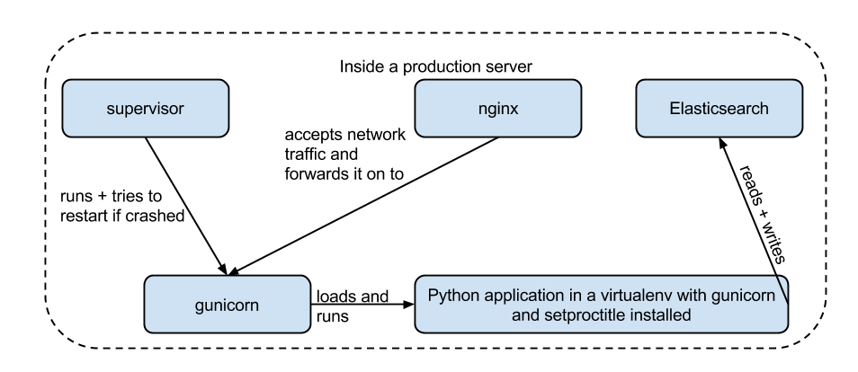

# Description

This is a Python app running on an Elasticsearch datastore back-end.

# Hardware

2GB RAM and 2 or more cores (virtual is ok) to keep Elasticsearch happy should be plenty. Disc space should be negligible, only requirement is that the disk isn't completely full, so e.g. 500 MB should be enough.

# Software requirements

- Elasticsearch 1.4.4 
- Python 2.7
- Elasticsearch itself requires Java 7 or 8 (preferably Oracle's) to run.
- Something to keep it running: Supervisor is common (a Python-based daemon for keeping apps running, retrying on failure and directing stdout/stderr to files). It is best to install that via pip ( http://supervisord.org/installing.html#installing-via-pip ) as packaged versions lag by several years.
- Dedicated WSGI web server in production. gunicorn (pip install gunicorn) is a common choice.
- Finally, something to respond to HTTP requests is needed. A recent-ish version of nginx forwarding locally to gunicorn is again very common though Apache can be used as well - just forward to 127.0.0.1:5050 (or whatever the gunicorn port has been set to when running the app)

# The stack and how it all fits together

# Deployment instructions

## Things to customise

1. user under which the app will run in supervisor config file deploy/reactordb-production
2. amount of RAM Elasticsearch should use for heap at deploy/elasticsearch/default-init-script-elasticsearch:6
3. domain name in nginx config at deploy/nginx/reactordb-production
4. commands as noted in the deployment instructions below in the comments

## Elasticsearch
Elasticsearch can be downloaded at https://www.elastic.co/downloads/past-releases/elasticsearch-1-4-4 and the Debian package at https://download.elastic.co/elasticsearch/elasticsearch/elasticsearch-1.4.4.deb is highly recommended. The instructions below assume it's been installed from the .deb with dpkg -i. After installing it:

- default-init-script-elasticsearch goes to /etc/default/elasticsearch
- elasticsearch.yml goes to /etc/elasticsearch/elasticsearch.yml
- logging.yml goes to /etc/elasticsearch/logging.yml

It can be stopped/started via sudo service elasticsearch stop|start|restart.

## The app

This assumes Elasticsearch is installed and up and running with the configs in the deploy/elasticsearch folder as per the section above.

Install Python 2.7 (minor version doesn't matter). Not tested with Python 3.x .

Install pip using [pip's very robust instructions](http://www.pip-installer.org/en/latest/installing.html). It might already come bundled with Python.
    
    sudo pip install virtualenv  # won't upgrade it if you already have it. pip install -- upgrade virtualenv for that.
    cd /opt
    sudo mkdir reactordb
    sudo chown user:user reactordb  # replace user with the user reactordb will run under
    cd reactordb
    virtualenv -p `which python2.7` env
    . env/bin/activate
    git clone https://github.com/CottageLabs/reactordb.git
    cd reactordb
    git submodule update --init --recursive
    git submodule update --recursive
    sudo apt-get install libxml2-dev libxslt-dev python-dev lib32z1-dev # install LXML dependencies on Linux
    cd esprit
    pip install -e .
    cd ..
    cd magnificent-octopus
    pip install -e .
    cd ..
    pip install -e .
    # try running the app
    APP_CONFIG=/opt/reactordb/reactordb/config/rootcfg.py python service/web.py

## nginx

Install nginx via apt-get. Put the configs in place.

    sudo cp nginx.conf /etc/nginx/nginx.conf
    sudo cp reactordb-production /etc/nginx/sites-available/
    cd /etc/nginx/sites-enabled/
    sudo ln -s ../sites-available/reactordb-production .
    # check symlink is ok
    ls -l
    sudo nginx -t  # test master config and our app config
    sudo nginx -s reload

## supervisor

Install supervisor via pip and then do some setup.

    # get latest version of supervisor via pip directly into root Python installation
    sudo pip install supervisor
    curl -s https://raw.githubusercontent.com/Supervisor/initscripts/eb55c1a15d186b6c356ca29b6e08c9de0fe16a7e/ubuntu > ~/supervisord
    sudo mv ~/supervisord /etc/init.d/supervisord
    sudo chmod a+x /etc/init.d/supervisord
    sudo service supervisord stop
    update-rc.d supervisord defaults
    sudo mkdir /var/log/supervisor
    sudo mkdir /etc/supervisor/
    sudo mkdir /etc/supervisor/conf.d
    
    # Path below relative to this script!
    sudo cp deploy/supervisor/supervisord.conf /etc/supervisor/supervisord.conf
    
    sudo ln -s /etc/supervisor/supervisord.conf /etc/supervisord.conf
    sudo ln -s /usr/local/bin/supervisord /usr/bin/supervisord
    sudo service supervisord start
    
    # check it's running and accessible
    sudo supervisorctl status  # should return nothing as we have no apps yet, but no errors either
    
    sudo cp deploy/supervisor/reactordb-production /etc/supervisor/conf.d/
    sudo supervisorctl reread
    sudo supervisorctl update
    sudo supervisorctl status  # the app should show up as RUNNING now
    
## Final test

We should now be able to access the app at the domain specified in the nginx config.
